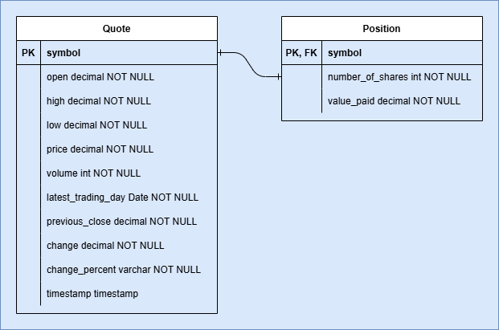

# Introduction
The Stock Quote app is a Java-based application that allows users to fetch real-time stock quote data, buy and sell stocks, and manage their portfolios and current positions. It uses JDBC to connect to a PostgreSQL database for performing CRUD operations. The latest stock data is retrieved from the Alpha Vantage API, ensuring up-to-date information for users. This application provides an efficient way for users to manage their investments and stay updated with market changes.
# Technologies Used
The development of this application involves technologies such as:
- Java
- Maven
- JDBC
- Alpha Vantage API (quote data)
- Jackson ObjectMapper
- Docker
- Logging Frameworks (BasicConfigurator,Logger,LoggerFactory) `log4j` `slf4j`
- IntelliJ IDE (recommended)

# Quick Start
To get started with the Stock Quote app, follow the steps below:

### Prerequisites:
- **Java 11+** installed
- **Maven** installed
- **PostgreSQL** database running
- **Docker** (optional, for containerized deployment)

### Steps:
1. Clone the repository
```bash
git clone
cd jdbc
```
2. Set up PostgreSQL Database
- Create a new database named stock_quote in PostgreSQL.
- The SQL commands to create the necessary tables and sample data are available in the sql folder. Navigate to the folder and execute the SQL scripts:
```bash
psql -U yourusername -d stock_quote -a -f tables.sql
```
- This will set up the quote and position tables in your database.

3. Configure Application Properties
- Set the database connection properties in the resources/properties.txt.
- Add your Alpha Vantage API key to the configuration file.

4. Build the Project
Run the following Maven command to build the project:
```bash
mvn clean install
```
5. Run the Application - Main.java


# Implementation
The Stock Quote app is structured using the following layers:

1. **DTOs (Data Transfer Objects)**

   QuoteDTO: Represents the stock quote data fetched from the Alpha Vantage API. 

   PositionDTO: Represents the user's stock position in the portfolio.


2. **Fetching Stock Quotes**

   The QuoteHttpHelper class is responsible for making HTTP requests to the Alpha Vantage API.
   
   The JSONParser class uses Jackson's ObjectMapper to deserialize the JSON response into QuoteDTO.


4. **Database**

   The app uses a PostgreSQL database with two main tables: quote (for storing stock data) and position (for tracking user stock holdings). 
   
   JDBC is used to interact with the database, and the DriverManager handles the database connection.


5. **DAO (Data Access Object)**

   QuoteDAO: Handles CRUD operations for stock quotes (create, read, update, delete).
   
   PositionDAO: Manages CRUD operations for user stock positions.
   
   CrudDAO: A generic interface that defines the contract for all DAO classes.


7. **Service Layer**

   QuoteService: Contains business logic related to stock quotes, including retrieving the latest quote and processing transactions.
   
   PositionService: Contains business logic for managing user portfolios, such as buying or selling stocks.


8. **Controller Layer**

   Acts as an orchestration layer.


9. **Main**

   The Main class is used to start the application and initiate the process.

# Database
The application uses a PostgreSQL database for persistent storage, which includes the following tables:

Quote Table: stores stock quotes data.


Position Table: stores the user's positions.

## ER Diagram
|  |
|:--------------------------------------------------:|


# Deployment
To containerize your own version of the app, follow these steps:

```bash
# Ensure Docker is running on background
# Build the Docker image and tag (change user, appname, tag(e.g., latest))
docker build -t username/appname:tag .

# Log in to Docker registry
docker login

# Push the image to the registry (change user, appname, tag(e.g., latest))
docker push username/appname:tag

# Pull the image from the registry
docker pull username/appname:latest

# To run the Docker container in interactive mode and allow terminal input, use the following command
docker run -it appname
```

Alternatively, for convenient access and usage, the image can be pulled from Docker hub.
```bash
# Pull the image from DockerHub
docker pull ivanzapanta123/stockapp
```

# Improvement
- User Authentication could potentially allow users to securely log in and manage their portfolios.
- Real-time Updates might offer users the ability to receive stock prices instantly.
- Advanced Stock Analysis could possibly provide features like technical analysis and historical data.
- Front-end UI could potentially include a web or desktop interface for a more intuitive user experience.