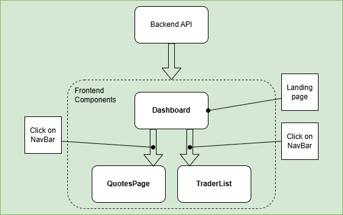

# Trading Frontend Application

## Introduction

This project is a trading application built with React that allows users to view and manage traders and stock quotes. The application is divided into two primary parts: the **Trader Dashboard** and the **Quotes Page**.

### Key Features:

- **Trader Management**: Users can add and delete traders. Each trader has attributes such as name, email, date of birth, and country.
- **Quote Display**: Users can view the latest stock quotes, including ticker, last price, bid price, ask price, and their respective sizes.

### Technologies Used:

- **Frontend**: React, Axios for HTTP requests, Ant Design for UI components.
- **Backend**: Node.js with Express (for managing traders and quotes).
- **Styling**: SCSS for component-level styling.
- **Others**: Font Awesome for icons.

This application provides an intuitive interface for managing trader information and viewing real-time stock market quotes, making it useful for financial analysts or anyone needing to track traders and stock prices in real time.

## Quick Start

To get started with the project, follow the steps below:

1. **Install Node.js and npm**:  
   [Download Node.js](https://nodejs.org/) and install npm.

2. **Install dependencies**:

   - Navigate to the `trading-ui` and `backend-trader-quotes` directories in the terminal and run:
     ```bash
     npm install
     ```

3. **Run the Backend**:

   - In the `backend-trader-quotes` directory, start the backend server:
     ```bash
     node index.js
     ```

4. **Run the Frontend**:
   - In the `trading-ui` directory, start the frontend React application:
     ```bash
     npm start
     ```

Once both the backend and frontend are running, users can access the app in the browser. `http://localhost:3000`

## Implementation

The application is built using a **React** frontend and a **Node.js** backend to manage trader data and stock quotes. Below is a breakdown of how the application is structured and how components interact:

### Backend:

- The backend exposes RESTful APIs to:
  - **Create** a trader.
  - **Delete** a trader.
  - **Fetch** the list of traders and stock quotes.

### Frontend:

- The frontend is built using React and includes:
  - A **Dashboard** to manage traders (add, delete).
  - A **Quotes Page** to display stock market quotes.

## Architecture

The application follows a client-server architecture where the frontend React app communicates with the backend via API requests. Below is a simple diagram representing the architecture:



## Test

The application was tested by interacting with both the frontend and backend through the user interface. The primary tests conducted include:

- Ensuring traders are added and deleted correctly.
- Verifying that the stock quotes are fetched and displayed properly.
- Checking that data validation works correctly (e.g., proper handling of invalid input when adding a trader).

For testing individual components, React’s **useEffect** and **Axios** were used for API calls, and **Ant Design** form validation was implemented for ensuring correct data entry.

## Improvements

Few things to improve or add in future versions of the app:

- **User Authentication** - to implement login/logout and role-based access control for different users.
- **Quote Management** - to add functionality to refresh quotes in real-time or periodically update the data from an external API.
- **Mobile Responsiveness** - to enhance the user interface to be more mobile-friendly for easier use on different devices.
