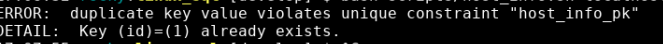
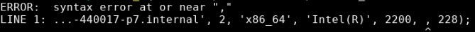
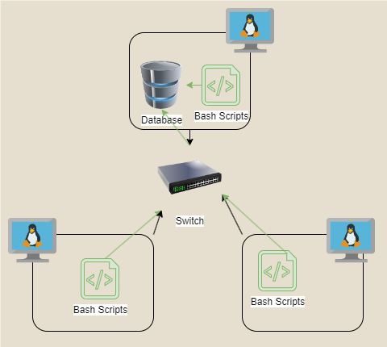

# Introduction
This project aims to create a system for the Jarvis Linux Cluster Administration (LCA) team to efficiently record and monitor hardware specifications and real-time resource usage within their CentOS Linux cluster. The users of this project are likely system administrators and IT professionals responsible for managing and optimizing the Linux cluster.

Key technologies used in the project include:
- PostgreSQL
- Crontab
- GitHub and Git
- Docker
- (Some linux commands and bash scripts)

# Quick Start
Follow these steps to quickly set up and use the Linux Cluster Monitoring Agent **(assuming the user is in the linux_sql directory)**:

To start a PostgreSQL instance, run the **psql_docker.sh** script.
```bash
./scripts/psql_docker.sh start
```
<br>&nbsp;<br>&nbsp;<br>

To create sample tables, use the **ddl.sql**

```bash
psql -h localhost -U postgres -d host_agent -f sql/ddl.sql
```

**Note**: If tests data are uncommented and added, remove them afterward to avoid this error when running_host info and host_usage scripts:


<br>&nbsp;<br>&nbsp;<br>

To isert hardware specs data into the DB, run the **host_info.sh** script.
```bash
bash scripts/host_info.sh localhost 5432 host_agent postgres password
```
<br>&nbsp;<br>&nbsp;<br>
To insert hardware usage data into the DB, run the **host_usage.sh** script.
```bash
bash scripts/host_usage.sh localhost 5432 host_agent postgres password
```


**Note:** If you encounter a syntax error similar to the one below when running the `host_info` and `host_usage` scripts, it may be due to your system outputting a different version of `lscpu` or `vmstat` that conflicts with the `grep` commands used in the scripts.



## Automation
Set up/ edit the crontab configuration by running the command:
```bash
crontab -e
```

# Implementation
The Linux Cluster Monitoring Agent has been implemented using different technologies and tools to ensure efficient data collection and management. Below are the key components of the implementation:

- **PostgreSQL**: -for storing and managing the collected data.

- **Crontab**- Cron was used to automate data collection, eliminating manual intervention. By implementing Cron jobs, monitoring agent scripts can run at set intervals, ensuring consistent data collection and providing timely insights into the cluster's health and performance.

- **GitHub and Git** - managed source code with version control, enabling collaboration, code tracking, and easy rollbacks.

- **Docker** - employed to leverage the provisioning of the PostgreSQL database and persisting data.

- **Linux Commands and Bash Scripts** - the monitoring agent's core functionality depends on Linux command lines and custom Bash scripts, which capture hardware specifications and monitor resource usage on the Linux cluster

By combining these technologies and tools, the Linux Cluster Monitoring Agent delivers an efficient and scalable solution for monitoring and managing a Linux cluster's performance and resource utilization.

## Architecture
|  |
|:---:|
- Data persistence (the ability to store data so it remains available even after an application or system restarts) can be achieved through the use of a psql instance.
- Server usage data is gathered by the bash agent, which subsequently inserts this data into the psql instance. The agent comprises two bash scripts designed for execution on each host, server, or node:
  
  - host_info.sh is responsible for gathering hardware information from the host and then storing it in the database. This script is executed only once, during the installation process.
    
  - host_usage.sh continually collects the current host usage metrics, including CPU and memory statistics, and inserts them into the database. This script is scheduled to run at regular intervals, typically triggered by a cron job.

## Scripts
**Shell script descriptions and usages (assuming the user is in the linux_sql directory)**

**psql_docker.sh**: used to start/stop the psql container.
```bash
# Script usage
# ./scripts/psql_docker.sh start|stop|create [db_username][db_password]

# Example
./scripts/psql_docker.sh start
```
<br>&nbsp;<br>&nbsp;<br>

**host_info.sh**: collects hardware specification data and then inserts the data into the psql instance.
```bash
# Script usage
# bash scripts/host_info.sh psql_host psql_port db_name psql_user psql_password

# Example
bash scripts/host_info.sh localhost 5432 host_agent postgres password
```
<br>&nbsp;<br>&nbsp;<br>

**host_usage.sh**: collects server usage data and then inserts the data into the psql database.
```bash
# Script usage
# bash scripts/host_usage.sh psql_host psql_port db_name psql_user psql_password

# Example
bash scripts/host_usage.sh localhost 5432 host_agent postgres password
```
<br>&nbsp;<br>&nbsp;<br>

**ddl.sql**: creates two tables (host_info & host_usage) automatically as sample input data.
```bash
# Initialize database and tables
psql -h localhost -U postgres -d host_agent -f sql/ddl.sql
```
<br>&nbsp;<br>&nbsp;<br>

**crontab**- automates tasks.
```bash
# To edit crontab jobs
crontab -e

# Verify that the crontab was successfully created by listing crontab jobs
crontab -ls

# Verify that the script is running as intended by checking the log file
cat /tmp/host_usage.sh
```
<br>&nbsp;<br>&nbsp;<br>

**queries.sql**: this sql file solves the following business problem:
  - The first query creates a table to store CPU number groups and populate it with data from the host_info table, organizing and sorting the data by total memory usage within each CPU group.

  - The second query calculates and rounds the average used memory percentage for hosts by combining data from the host_usage and host_info tables. It aims to provide insights into memory usage patterns over time.

  - The third query counts the data points within 5-minute intervals from the host_usage table. It then classifies hosts as "Healthy" or "Failure" based on the number of data points collected within these intervals, helping monitor host data consistency.

## Database Modeling

**Host Info Table / `host_info`**

This table stores the information about the host's hardware specifications.

| **Column name**  | **Description**                              |
|------------------|:---------------------------------------------|
| id               | Host id                                      |
| hostname         | Name of the system host                      |
| cpu_number       | Number of CPUs or cores                      |
| cpu_architecture | CPU architecture                             |
| cpu_model        | CPU model or name                            |
| cpu_mhz          | CPU clock speed in MHz                       |
| l2_cache         | Size of L2 cache in kB                       |
| total_mem        | Total memory available on the system in kB   |
| timestamp        | Current time in `2019-11-26 14:40:19` format |
<br><br>

**Host Info Table / `host_usage`**

This table stores the resource usage data of the hosts over time.

| **Column name**| **Description**                              |
|----------------|:---------------------------------------------|
| timestamp      | Current time in `2019-11-26 14:40:19` format |
| host_id        | Unique identifier for the host or system     |
| memory_free    | Amount of free memory available on the host  |
| cpu_idle       | Percentage of CPU idle time                  |
| cpu_kernel     | Percentage of CPU time spent in the kernel   |
| disk_io        | Blocks received from a block device          |
| disk_available | Amount of disk space available on the system |
<br>

# Test

For testing bash scripts:
1. Using Debug Mode:
```bash
# To debug add -x option after the bash script
bash -x ./scripts/host_usage.sh
```

- Check for Syntax Errors
- Include Error Handling
  - Using conditional statements and exit codes to manage unexpected situations.
- Use of Version Control
  - Employ version control to track changes and revert to previous versions if necessary.
<br><br>

2. For testing the DDL (Data Definition Language):

- Test with Sample Data- create sample input data and test it with various scenarios to ensure the script behaves as expected (e.g., ensuring the hostname is unique).
- Check if tables are created in current database


3. For testing crontabs:
Logging - create a logging to capture important information and errors. This can be achieve by redirecting the script's output to a log file.
```bash
bash path/to/location > /tmp/host_usage.log
```

# Deployment
The app was deployed by configuring the host_usage.sh script with execute permissions using the **chmod +x** command, allowing it to be executed as an executable within a Linux environment. Following this, the deployment involved scheduling the script's execution using **crontab**, which automated the process of collecting server usage data or executing other specified tasks at predefined intervals, all without requiring manual intervention.

# Improvements
- **Resource Allocation Alerts**- notify admins when resource thresholds (e.g., CPU, memory) are exceeded to prevent performance issues.

- **Regular Backups**- automate backups of critical data and configuration files to avoid data loss.

- **Resource Cleanup Automation**- create scripts to automate the removal of unused resources, optimizing utilization and freeing up capacity.
