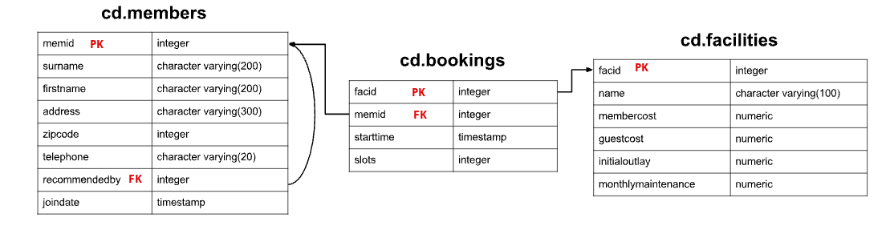

# Introduction
This repository contains a series of SQL practice exercises focused on enhancing SQL skills and proficiency. The exercises cover a range of SQL concepts, including:

- MODIFYING DATA: Add, update, and delete records in tables.
- BASICS: Basic SQL queries, including filtering and retrieval.
- JOIN: Joining tables to fetch related data.
- AGGREGATION: Using aggregate functions for summarizing data.
- STRING: Manipulating and querying text data.

# SQL Queries
###### Table Setup (DDL)


### MODIFYING DATA

###### Question 1: The club is adding a new facility - a spa. We need to add it into the facilities table. Use the following values:
###### facid: 9, Name: 'Spa', membercost: 20, guestcost: 30, initialoutlay: 100000, monthlymaintenance: 800.
```sql
INSERT INTO cd.facilities (
  facid, name, membercost, guestcost, initialoutlay, monthlymaintenance
) 
VALUES 
  (9, 'Spa', 20, 30, 100000, 800);
```

###### Question 2: Let's try adding the spa to the facilities table again. This time, though, we want to automatically generate the value for the next facid, rather than specifying it as a constant. Use the following values for everything else:
###### Name: 'Spa', membercost: 20, guestcost: 30, initialoutlay: 100000, monthlymaintenance: 800.
```sql
INSERT INTO cd.facilities (
    facid,
    name,
    membercost,
    guestcost,
    initialoutlay,
    monthlymaintenance
)
SELECT
    (SELECT MAX(facid) FROM cd.facilities) + 1,
    'Spa',
    20,
    30,
    100000,
    800;
```

###### Question 3: We made a mistake when entering the data for the second tennis court. The initial outlay was 10000 rather than 8000: you need to alter the data to fix the error.
```sql
UPDATE cd.facilities
SET initialoutlay = 10000
WHERE facid = 1;
``` 

###### Question 4: We want to alter the price of the second tennis court so that it costs 10% more than the first one. Try to do this without using constant values for the prices, so that we can reuse the statement if we want to.
```sql
UPDATE cd.facilities facs
SET
    membercost = (SELECT membercost * 1.1 FROM cd.facilities WHERE facid = 0),
    guestcost = (SELECT guestcost * 1.1 FROM cd.facilities WHERE facid = 0)
WHERE facs.facid = 1;
```

###### Question 5: As part of a clearout of our database, we want to delete all bookings from the cd.bookings table. How can we accomplish this?
```sql
DELETE FROM cd.bookings;
TRUNCATE cd.bookings;
```

######Question 6: We want to remove member 37, who has never made a booking, from our database. How can we achieve that?
```sql
DELETE FROM cd.members;
WHERE memid = 37; 
```

### BASICS

###### Question 1: How can you produce a list of all facilities with the word 'Tennis' in their name?
```sql
SELECT
    *
FROM
    cd.facilities
WHERE
    name LIKE '%Tennis%';
```

###### Question 2:How can you retrieve the details of facilities with ID 1 and 5? Try to do it without using the OR operator.
```sql
SELECT
    *
FROM
    cd.facilities
WHERE
    facid IN (1, 5);
```

###### Question 3: How can you produce a list of members who joined after the start of September 2012? Return the memid, surname, firstname, and joindate of the members in question.
```sql
SELECT
    memid,
    surname,
    firstname,
    joindate
FROM
    cd.members
WHERE
    joindate >= '2012-09-01';
```

###### Question 4: You, for some reason, want a combined list of all surnames and all facility names. Yes, this is a contrived example :-). Produce that list!
```sql
SELECT
    surname
FROM
    cd.members
UNION
SELECT
    name
FROM
    cd.facilities;
```

###### Question 5: How can you produce a list of facilities that charge a fee to members, and that fee is less than 1/50th of the monthly maintenance cost? Return the facid, facility name, member cost, and monthly maintenance of the facilities in question.
```sql
SELECT
    facid,
    name,
    membercost,
    monthlymaintenance
FROM
    cd.facilities
WHERE
    membercost > 0 AND
    (membercost < monthlymaintenance/50);
```

### JOIN

###### Question 1: How can you produce a list of the start times for bookings by members named 'David Farrell'?
```sql
SELECT
    bks.startime
FROM
    cd.bookings bks
    INNER JOIN cd.members mems ON mems.memid = bks.memid
WHERE
    mems.firstname = 'David' AND
    mems.surname = 'Farrell';
```

###### Question 2: How can you produce a list of the start times for bookings for tennis courts, for the date '2012-09-21'? Return a list of start time and facility name pairings, ordered by the time.
```sql
SELECT
    bks.starttime AS START,
    facs.name AS name
FROM
    cd.facilities facs
    INNER JOIN cd.bookings bks ON facs.facid = bks.facid
WHERE
    facs.name IN ('Tennis Court 2', 'Tennis Court 1') AND
    bks.starttime >= '2012-09-21' AND
    bks.starttime < '2012-09-22'
ORDER BY
    bks.starttime;
```

###### Question 3: How can you output a list of all members, including the individual who recommended them (if any)? Ensure that results are ordered by (surname, firstname).
```sql
SELECT
    mems.firstname AS memfname,
    mems.surname AS memsname,
    recs.firstname AS recfname,
    recs.surname AS recsname
FROM
    cd.members mems
    LEFT OUTER JOIN cd.members recs ON recs.memid = mems.recommendedby
ORDER BY
    memsname,
    memfname;
```

###### Question 4: How can you output a list of all members who have recommended another member? Ensure that there are no duplicates in the list, and that results are ordered by (surname, firstname).
```sql
SELECT
    DISTINCT recs.firstname AS firstname,
    recs.surname AS surname
FROM
    cd.members mems
    INNER JOIN cd.members recs ON recs.memid = mems.recommendedby
ORDER BY
    surname,
    firstname;SELECT
    DISTINCT recs.firstname AS firstname,
    recs.surname AS surname
FROM
    cd.members mems
    INNER JOIN cd.members recs ON recs.memid = mems.recommendedby
ORDER BY
    surname,
    firstname;
```

###### Question 5: How can you output a list of all members, including the individual who recommended them (if any), without using any joins? Ensure that there are no duplicates in the list, and that each firstname + surname pairing is formatted as a column and ordered.
```sql
SELECT
    DISTINCT mems.firstname | | ' ' | | mems.surname AS MEMBER,
    (
        SELECT
            recs.firstname | | ' ' | | recs.surname AS recommender
        FROM
            cd.members recs
        WHERE
            recs.memid = mems.recommendedby
    )
FROM
    cd.members mems
ORDER BY
    MEMBER;
```

### AGGREGATION

###### Question 1: Produce a count of the number of recommendations each member has made. Order by member ID.
```sql
SELECT
    recommendedby,
    COUNT(*)
FROM
    cd.members
WHERE
    recommendedby IS NOT NULL
GROUP BY
    recommendedby
ORDER BY
    recommendedby;
```

###### Question 2: Produce a list of the total number of slots booked per facility. For now, just produce an output table consisting of facility id and slots, sorted by facility id.
```sql
SELECT
    facid,
    SUM(slots) AS "Total Slots"
FROM
    cd.bookings
GROUP BY
    facid
ORDER BY
    facid;
```

###### Question 3: Produce a list of the total number of slots booked per facility in the month of September 2012. Produce an output table consisting of facility id and slots, sorted by the number of slots.
```sql
SELECT
    facid,
    SUM(slots) AS "Total Slots"
FROM
    cd.bookings
WHERE
    starttime >= '2012-09-01'
    AND starttime < '2012-10-01'
GROUP BY
    facid
ORDER BY
    SUM(slots);
```

###### Question 4: Produce a list of the total number of slots booked per facility per month in the year of 2012. Produce an output table consisting of facility id and slots, sorted by the id and month.
```sql
SELECT
    facid,
    EXTRACT(
        MONTH
        FROM
            starttime
    ) AS MONTH,
    SUM(slots) AS "Total Slots"
FROM
    cd.bookings
WHERE
    EXTRACT(
        YEAR
        FROM
            starttime
    ) = 2012
GROUP BY
    facid,
    MONTH
ORDER BY
    facid,
    MONTH;
```

###### Question 5: Find the total number of members (including guests) who have made at least one booking.
```sql
SELECT
    COUNT(DISTINCT memid)
FROM
    cd.bookings
```

###### Question 6: Produce a list of each member name, id, and their first booking after September 1st 2012. Order by member ID.
```sql
SELECT
    mems.surname,
    mems.firstname,
    mems.memid,
    MIN(bks.starttime) AS starttime
FROM
    cd.bookings bks
    INNER JOIN cd.members mems ON mems.memid = bks.memid
WHERE
    starttime >= '2012-09-01'
GROUP BY
    mems.surname,
    mems.firstname,
    mems.memid
ORDER BY
    mems.memid;
```

###### Question 7: Produce a list of member names, with each row containing the total member count. Order by join date, and include guest members.
```sql
SELECT
    COUNT(*) OVER(),
    firstname,
    surname
FROM
    cd.members
ORDER BY
    joindate
```

###### Question 8: Produce a monotonically increasing numbered list of members (including guests), ordered by their date of joining. Remember that member IDs are not guaranteed to be sequential.
```sql
SELECT
    ROW_NUMBER() OVER(
        ORDER BY
            joindate
    ),
    firstname,
    surname
FROM
    cd.members
ORDER BY
    joindate
```

###### Question 9: Output the facility id that has the highest number of slots booked. Ensure that in the event of a tie, all tieing results get output.
```sql
SELECT
    facid,
    total
FROM
    (
        SELECT
            facid,
            SUM(slots) total,
            RANK() OVER (
                ORDER BY
                    SUM(slots) desc
            ) RANK
        FROM
            cd.bookings
        GROUP BY
            facid
    ) AS ranked
WHERE
    RANK = 1
```

### STRING

###### Question 1: Output the names of all members, formatted as 'Surname, Firstname'
```sql
SELECT
    surname || ', ' || firstname AS name
FROM
    cd.members
```

###### Question 2: You've noticed that the club's member table has telephone numbers with very inconsistent formatting. You'd like to find all the telephone numbers that contain parentheses, returning the member ID and telephone number sorted by member ID.
```sql
SELECT
    memid,
    telephone
FROM
    cd.members
WHERE
    telephone ~ '[()]';
```

###### Question 3: You'd like to produce a count of how many members you have whose surname starts with each letter of the alphabet. Sort by the letter, and don't worry about printing out a letter if the count is 0.
```sql
SELECT
    substr (mems.surname, 1, 1) AS letter,
    COUNT(*) AS COUNT
FROM
    cd.members mems
GROUP BY
    letter
ORDER BY
    letter;
```